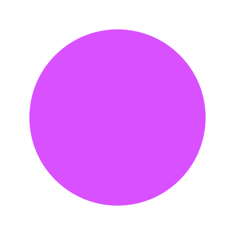
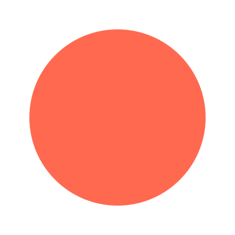
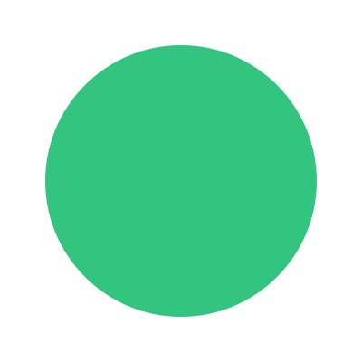
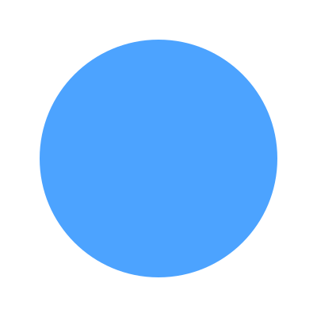
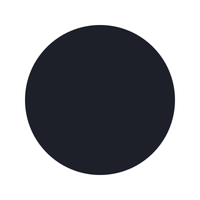
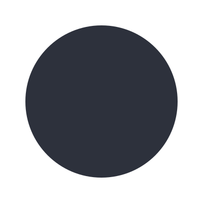

## Colors

<h2>Color palette</h2>

|                                                         | Name          |    Hex    | Usage                                                                             |
| :-----------------------------------------------------: | :------------ | :-------: | :-------------------------------------------------------------------------------- |
|                 | Seekrs        | `#D950FF` | new Seekers Color                                                                 |
|                | Seekers       | `#FF6950` | Seekers Color                                                                     |
|             | Architects    | `#33C47F` | Architects Color                                                                  |
|               | Analysts      | `#33C47F` | Architects Color                                                                  |
|               | Surface0      | `#1d2028` | Background Color                                                                  |
|               | Surface1      | `#2d313c` | Lighter Background Color                                                          |
